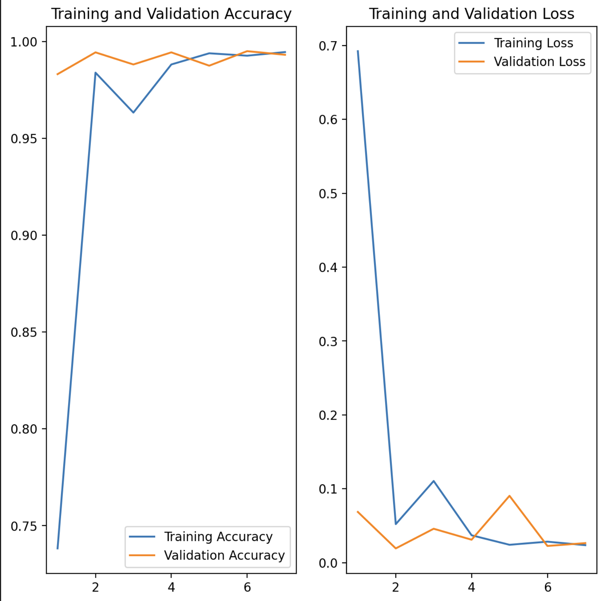
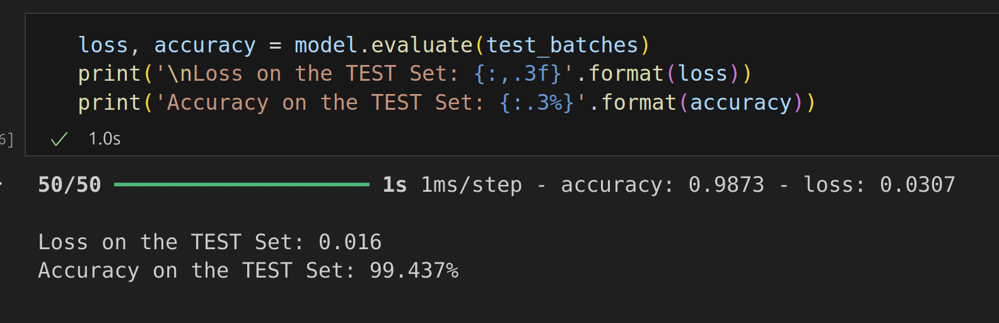
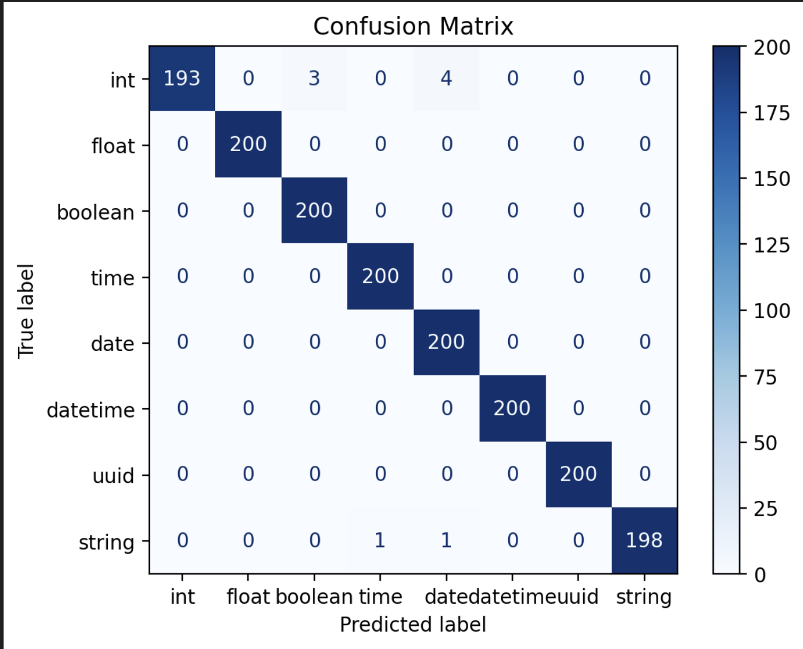

# SuperNova

### Neural Network for predicting data types from raw strings eg csv, json etc
###

Docker run command: `docker run --name supernova --restart always -p 8090:80 -d potapenkooleg/supernova` 

Or use docker-compose.yml file attached 

Web UI available at **http://localhost:8090/docs**

DockerHub: **https://hub.docker.com/r/potapenkooleg/supernova**

## Screenshots

