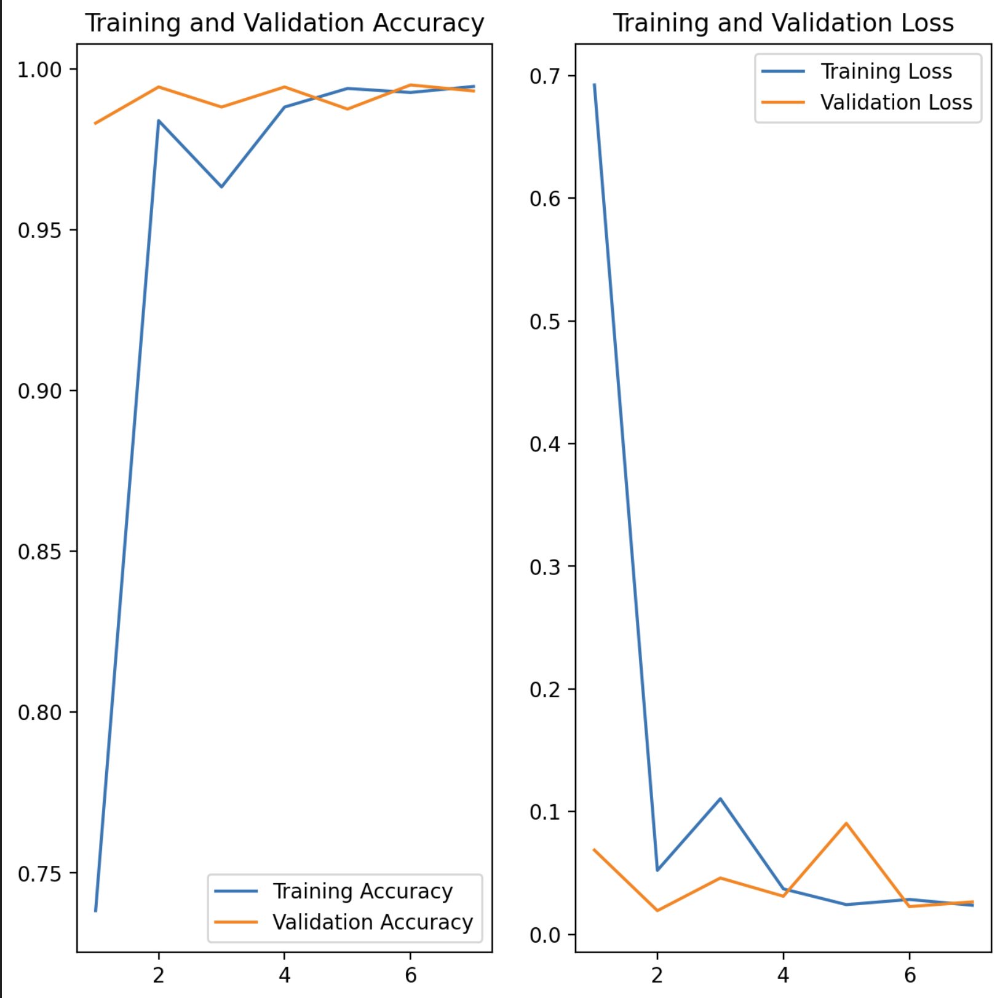
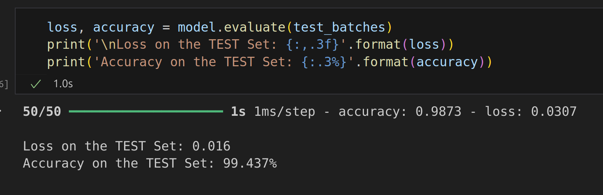
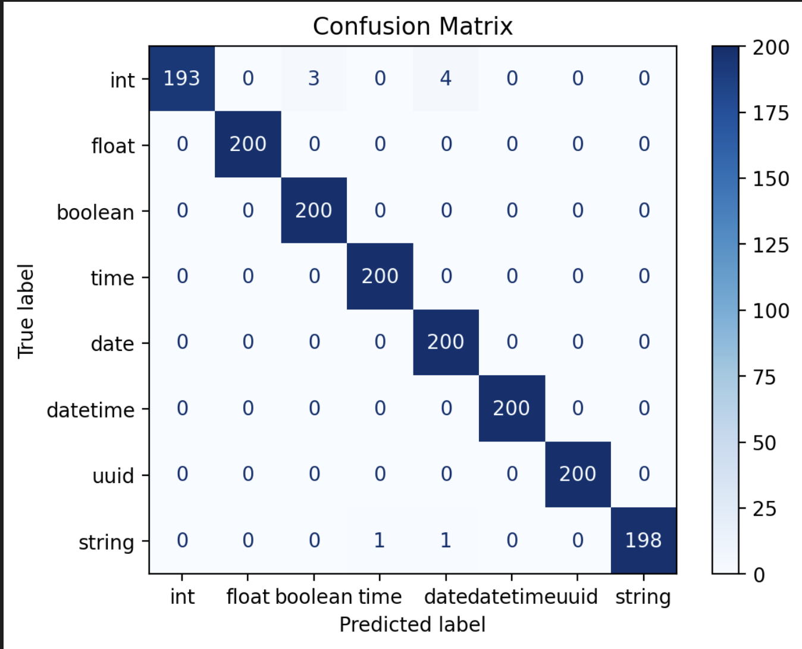

# SuperNova

### Neural Network for predicting data types from raw strings eg csv, json etc

## How to run

### Run locally

FastAPI CLI's production-mode command. Adjust --port to whatever port you want locally (e.g. --port 8000)
`fastapi run main.py --port 80`

If you want to run it directly with plain uv in this project (which uses uv.lock/pyproject.toml)

`uv run fastapi run main.py --port 80`

For local development with auto-reload instead of the production server, use:

`fastapi dev main.py --port 80` (or `uv run fastapi dev main.py --port 80`)    

### Docker
Docker run command: `docker run --name supernova --restart always -p 8090:80 -d potapenkooleg/supernova` 

Or use docker-compose.yml file attached 

## Swagger

Web UI available at **http://localhost:8090/docs**

DockerHub: **https://hub.docker.com/r/potapenkooleg/supernova**

## Endpoints

### GET ('/')
Support load balancer heart beat

### POST ('/predict')
Predict data type from raw string

### POST ('bulk_predict')
Bulk predict data type from list of raw strings. Each entry gets its own prediction

### POST ('/vote_predict')
Gets class from the list of samples
"soft_vote" parameter used to get a simple majority vote or probability-based vote

- "soft_vote": false – Returns class with most samples. If ties return class with the highest sum of probabilities 

- "soft_vote": true – Returns class with the highest sum of probabilities. If ties return class with most samples

### GET ('/classes')
Returns a list of available classes

### GET ('/version')
Returns product version

## Model information

